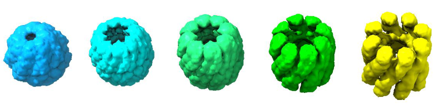

# MorphOT: Transport-based interpolation between EM maps with UCSF ChimeraX



MorphOT is  a  plugin  for ChimeraX,  which  allows  users  to  directly  interpolate  multiple density maps.  It relies on adapting and optimizing for EM maps some recent methods of shape interpolation based on optimal transport (OT), resulting in significant improvement in quality of morphing,  compared with the standard command provided withChimeraX. For more details on the method, please see the appendix [here](https://raw.githubusercontent.com/kdd-ubc/MorphOT/master/MorphOT_user_manual.pdf) and the [paper accompanying the software](https://www.biorxiv.org/content/10.1101/2020.09.08.286302v1).

This is the repository for distributing our software. For installing and running the software, please refer to the User Manual pdf file or see below.

# Installation

## Development and requirements

MorphOT has been developed using Python 3.7 and is implemented as a plugin for UCSF ChimeraX. The plugin was tested on the version 1.0 of ChimeraX. A GPU implementation of all MorphOT functions  is  also  provided,  which  requires  NVidia  GPUs  and  the  CudaToolkit to be run.

## Downloading and running ChimeraX-morphOT

To download and install MorphOT, first download the source code folder `otmorph-bundle` available at the following Github link. To install, start ChimeraX and type the following command line:

```
devel build Path/To/Source/Code/otmorph−bundle
```
and
```
devel install Path/To/Source/Code/otmorph−bundle
```

Remark: After review by the UCSF ChimeraX team, the tool will be available in the ChimeraX Tool menu (More tools).

# Tutorial

## Pre-processing the density maps

Load the EMDB map 5140, smooth it using a gaussian blur, threshold it at the desired value, and rescale it, following the commands below:
```
open emdb:5140
volume gaussian #1 sd 2
volume threshold #2 min 0.35
volume scale #3 shift -0.35
```

Follow the same steps on the EMDB map 5138:
```
open emdb:5138
volume gaussian #5 sd 2
volume threshold #6 min 0.12
volume scale #7 shift -0.12
```

Align the two resulting maps and resample the second on the first:
```
fitmap #4 in #8
volume resample #8 onGrid #1
```

Remark: This pre-processing is notably meant to remove the noise around the structure, otherwise the interpolation will try to displace mass that is not part of the molecule, such as noisy blobs in the solvent region. Thresholding and smoothing is one way to deal with this but other approaches can be followed by the user to deal with this, possibly leveraging several tools available in ChimeraX. For instance, another possible strategy could be for the user to first mask the solvent region in the maps.

## Using MorphOT

### Not sure what options you have?
If you are not sure, you can type `help MorphOT` in the command-line interface of ChimeraX and check the usage recommendations in the Log window.

### Create morphs

To produce a standard transport-based trajectory, type:
```
MorphOT morphOT #4 #9
```

For faster computation, you can use:
```
MorphOT semiMorphOT #4 #9 otFrames 5 frames 25
```

### Replaying morphs

In order to replay a morph that you just generated, do:
```
MorphOT morphOT #4 #9 model #10
```

Alternatively, you can export the morph to a movie following:
```
movie record
MorphOT morphOT [options]
movie stop
movie encode [path]
```

Remark: the movie will be generated with voxel size 1.

# Computing Time

Here are the times MorphOT takes to run a trajectory of 25 frames with the previous maps, for both CPU and GPU implementations

Grid        | CPU (Intel(R) Xeon(R) Silver 4116 CPU @ 2.10GHz) | GPU (Tesla V100)
:----------:|:------------------------------------------------:|:---------------:
64x64x64    | 28s (1.1s per frame)                             | 17s (0.68s per frame)
192x192x192 | 1,418s (57s per frame)                           | 998s (40s per frame) 

# Videos
These animations display the result that one should obtain by following the tutorial above, comparing traditional linear interpolation (left) and the transport-based trajectory (right).
Linear            |  MorphOT
:-------------------------:|:-------------------------:
  |  

